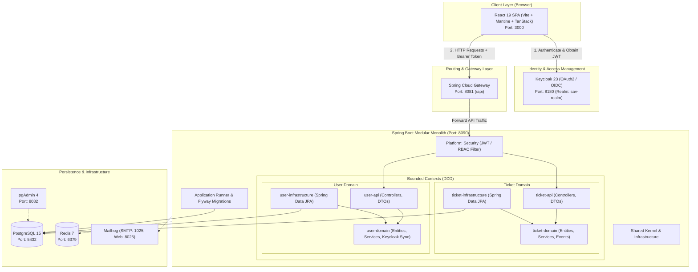

# OmniShift SAV - Support & After-Sales Management Platform

[](https://www.oracle.com/java/)
[](https://spring.io/projects/spring-boot)
[](https://react.dev/)
[](https://www.typescriptlang.org/)
[](https://vitejs.dev/)
[](https://www.keycloak.org/)
[](https://www.postgresql.org/)
[](https://www.docker.com/)
[](https://github.com/lachgar03/omnishift-sav/actions/workflows/ci.yml)
[](LICENSE)

**OmniShift SAV** (Service Après-Vente) is an enterprise-grade, full-stack support ticket and incident management platform. Developed independently during an engineering internship and subsequently refactored into a portfolio project, OmniShift showcases clean architecture, Domain-Driven Design (DDD) modular boundaries, robust role-based security, automated test suites, and modern frontend practices for junior/mid-level full-stack engineering roles.

---

## 📑 Table of Contents

- [Project Context & Engineering Goals](#-project-context--engineering-goals)
- [System Architecture](#-system-architecture)
- [Monorepo Structure](#-monorepo-structure)
- [Implemented Features vs. Roadmap](#-implemented-features-vs-roadmap)
- [Role-Based Access Control (RBAC)](#-role-based-access-control-rbac)
- [Technology Stack](#-technology-stack)
- [Prerequisites](#-prerequisites)
- [Getting Started](#-getting-started)
  - [1. Infrastructure Services (Docker Compose)](#1-infrastructure-services-docker-compose)
  - [2. Keycloak IAM Setup](#2-keycloak-iam-setup)
  - [3. Backend Setup](#3-backend-setup)
  - [4. Frontend Setup](#4-frontend-setup)
- [Ports & Services Reference](#-ports--services-reference)
- [API Overview & Authentication Flow](#-api-overview--authentication-flow)
- [Testing & Quality Assurance](#-testing--quality-assurance)
- [Engineering Tradeoffs & Limitations](#-engineering-tradeoffs--limitations)
- [License](#-license)

---

## 🎯 Project Context & Engineering Goals

OmniShift SAV was initially conceived and engineered to streamline after-sales support operations, ticket triage, and communication between end-users, support technicians, and administrators. 

### Key Architectural Refactoring Highlights:
1. **Modular Monolith with Domain-Driven Design (DDD)**: Clear bounded contexts (`ticket`, `user`) separated into strict layered modules (`api`, `domain`, `infrastructure`) preventing cross-boundary leakage.
2. **Robust Spring Boot Backend**:
   - Resolved SQL dialect portability issues (PostgreSQL standard queries replacing vendor-specific functions).
   - Lombok safety: Eliminated circular recursion and `StackOverflowError` risks on bidirectional JPA entities.
   - Clean profile isolation: Debug endpoints restricted to `dev`/`test` environments; credentials externalized via environment variables.
   - Standardized Flyway schema migrations (`V1__Initial_schema.sql`).
3. **Modern React 19 Frontend**:
   - Strict separation of routing definitions (`src/routes/`) from page views (`src/pages/`) and components (`src/components/`), resolving TanStack Router file-scanner conflicts.
   - Deduplication of ticket management interfaces, unifying user ticket queues and general queues into configurable components.
   - Centralized Axios client architecture with automatic Keycloak token attachment and error interception.
4. **Comprehensive Test Automation & CI**:
   - Full suite of unit, domain logic, and MockMvc integration tests.
   - GitHub Actions CI pipeline validating both backend Maven reactor build/tests and frontend ESLint/TypeScript/Vite builds on every push and pull request.

---

## 🏗️ System Architecture

OmniShift SAV uses a **decoupled monorepo** architecture:
- **Client Layer**: React 19 SPA powered by Vite, Mantine UI component library, TanStack Router, and TanStack Query.
- **Identity & Access Management (IAM)**: Keycloak 23 providing OAuth2/OIDC token issuance, role management, and SSO.
- **API Gateway**: Spring Cloud Gateway routing client requests, handling CORS abstraction, and proxying to backend services.
- **Backend Application**: Spring Boot 3.2.5 Modular Monolith implementing DDD principles, Spring Security OAuth2 Resource Server, and Flyway database migrations.
- **Persistence & Caching**: PostgreSQL 15 relational database with Redis 7 caching and session support.



---

## 📁 Monorepo Structure

```text
omnishift-sav/
├── .github/
│   └── workflows/
│       └── ci.yml                     # GitHub Actions CI (Backend Maven + Frontend npm)
├── docker-compose.yml                 # Root container orchestration (Postgres, Keycloak, Redis, etc.)
├── sav-backend/                       # Spring Boot 3 Modular Monolith
│   ├── application/                   # Main application entry point, configs & Flyway migrations
│   │   ├── src/main/java/com/sav/app/ # Spring Boot runner, GlobalExceptionHandler, RateLimiting
│   │   ├── src/main/resources/db/     # Flyway SQL migrations (V1__Initial_schema.sql)
│   │   └── src/test/java/com/sav/app/ # MockMvc integration & exception handler tests
│   ├── domains/                       # Bounded Contexts
│   │   ├── ticket/                    # Ticket Bounded Context
│   │   │   ├── ticket-api/            # REST controllers, request/response DTOs
│   │   │   ├── ticket-domain/         # Domain entities, aggregates, business services & unit tests
│   │   │   └── ticket-infrastructure/ # Spring Data JPA repositories & database adapters
│   │   └── user/                      # User Bounded Context
│   │       ├── user-api/              # User controllers & profile endpoints
│   │       ├── user-domain/           # User entities, services, Keycloak JIT sync & unit tests
│   │       └── user-infrastructure/   # User persistence & repository implementations
│   ├── infrastructure/                # Cross-Cutting Infrastructure
│   │   ├── parent/                    # Parent POM with shared dependency management
│   │   └── shared/                    # Shared enums, domain events, exceptions, utility classes
│   ├── platform/                      # Platform Modules
│   │   ├── gateway/                   # Spring Cloud Gateway (Port 8081)
│   │   └── security/                  # OAuth2 JWT resource server config & SecurityUtil
│   ├── init-scripts/                  # PostgreSQL initialization scripts
│   ├── pom.xml                        # Root Maven reactor build definition
│   └── README.md                      # Backend-specific documentation
│
├── sav-frontend/
│   └── front-tickets/                 # React 19 TypeScript Single Page Application
│       ├── public/                    # Static assets
│       ├── src/
│       │   ├── api/                   # Unified Axios client & TanStack query client
│       │   ├── components/            # Reusable UI components & ProtectedRoute
│       │   ├── pages/                 # Full-page view components (Tickets, Details, Admin, etc.)
│       │   ├── routes/                # TanStack Router type-safe route definitions
│       │   ├── services/              # API domain services (ticketService, userService)
│       │   ├── store/                 # Zustand state stores (authStore, uiStore)
│       │   ├── types/                 # TypeScript interfaces & API contracts
│       │   └── main.tsx               # Application bootstrap
│       ├── package.json               # Frontend dependencies & scripts
│       ├── tsconfig.json              # TypeScript configuration with path aliases (@pages, etc.)
│       └── vite.config.ts             # Vite build & plugin configuration
└── README.md                          # Repository documentation (this file)
```

---

## ⚡ Implemented Features vs. Roadmap

To maintain clear and honest engineering standards, the table below distinguishes features fully implemented and verified in the codebase from prospective roadmap items:

| Feature / Capability | Status | Description |
|---|:---:|---|
| **Ticket Lifecycle Management** | ✅ Implemented | Complete state machine: `OPEN` → `ASSIGNED` → `IN_PROGRESS` → `RESOLVED` → `CLOSED` / `REOPENED`. |
| **Role-Based Access Control (RBAC)** | ✅ Implemented | Method-level security and UI guards for `USER`, `TECHNICIAN`, and `ADMIN`. |
| **Ticket Discussion & Attachments** | ✅ Implemented | Multi-user conversation threads per ticket with file attachment support. |
| **Technician Workflow Queues** | ✅ Implemented | Pre-filtered views for unassigned, critical, and team-assigned tickets. |
| **Automated Keycloak JIT Sync** | ✅ Implemented | Just-In-Time synchronization of user profile and roles into PostgreSQL upon first JWT authentication. |
| **Rate Limiting Protection** | ✅ Implemented | In-memory token bucket interceptor guarding sensitive endpoints against abuse. |
| **Database Migrations** | ✅ Implemented | Versioned Flyway migrations ensuring repeatable schema deployments. |
| **Centralized API Gateway** | ✅ Implemented | Spring Cloud Gateway routing requests on `:8081` to backend services. |
| **Admin KPIs & Statistics** | ✅ Implemented | Native aggregate queries computing system-wide ticket resolution metrics and workload counts. |
| **Automated Test Suite & CI** | ✅ Implemented | 31 automated backend tests (MockMvc + JUnit 5/Mockito) and GitHub Actions pipeline. |
| **Real-time Push Notifications** | 📋 Roadmap | WebSocket / Server-Sent Events (SSE) for instant ticket update toasts. |
| **Automated SLA Escalation Engine** | 📋 Roadmap | Background Quartz/Spring scheduler triggering SLA escalation events. |
| **Distributed Caching (Redis)** | 📋 Roadmap | Expanding Redis from session storage to distributed query result caching. |
| **Full-Text Search Engine** | 📋 Roadmap | Elasticsearch / OpenSearch integration for deep ticket search. |

---

## 🔐 Role-Based Access Control (RBAC)

The platform enforces strict role boundaries:

| Capability | USER | TECHNICIAN | ADMIN |
|---|:---:|:---:|:---:|
| Create & view own tickets | ✅ | ✅ | ✅ |
| Add messages & attachments to own tickets | ✅ | ✅ | ✅ |
| Access personal dashboard | ✅ | ✅ | ✅ |
| View all tickets across the system | ❌ | ✅ | ✅ |
| Update ticket status, priority & resolution | ❌ | ✅ | ✅ |
| Access technician workflow queues | ❌ | ✅ | ✅ |
| Assign tickets to self or other technicians | ❌ | ❌ | ✅ |
| Create and manage user profiles & roles | ❌ | ❌ | ✅ |
| Access system administration & metrics | ❌ | ❌ | ✅ |

---

## 💻 Technology Stack

### Backend
- **Language**: Java 17
- **Framework**: Spring Boot 3.2.5
- **Security**: Spring Security 6.x (OAuth2 Resource Server, JWT validation)
- **API Gateway**: Spring Cloud Gateway (2023.0.x)
- **Persistence**: Spring Data JPA / Hibernate, Flyway Migrations
- **Database**: PostgreSQL 15
- **Caching**: Redis 7
- **Build Tool**: Apache Maven 3.9+ (Multi-module reactor)

### Frontend
- **Language**: TypeScript 5.9
- **UI Library**: React 19
- **Bundler & Dev Server**: Vite 7.1
- **Routing**: TanStack Router 1.131 (type-safe code-based routing)
- **Data Fetching**: TanStack Query 5.85 (React Query)
- **Component Library**: Mantine UI 8.2 & Tabler Icons
- **State Management**: Zustand 5.0
- **HTTP Client**: Axios 1.11 with Keycloak interceptor
- **Code Quality**: ESLint 9 (Flat Config), Prettier 3

---

## ⚙️ Prerequisites

Ensure the following tools are installed on your workstation:
- **Java Development Kit (JDK) 17+**
- **Node.js 18+** & **npm** (or yarn)
- **Docker** & **Docker Compose**
- **Git**

---

## 🚀 Getting Started

Follow these steps to spin up the entire OmniShift SAV ecosystem locally:

### 1. Infrastructure Services (Docker Compose)

From the project root, start all backing infrastructure containers:

```bash
docker compose up -d
```

Verify that all containers are healthy:
- **PostgreSQL**: `localhost:5432`
- **Keycloak**: `localhost:8180`
- **Redis**: `localhost:6379`
- **Mailhog**: `localhost:8025` (Web UI) / `localhost:1025` (SMTP)
- **pgAdmin 4**: `localhost:8082`

### 2. Keycloak IAM Setup

1. Open the Keycloak Admin Console: **[http://localhost:8180/admin](http://localhost:8180/admin)**
2. Log in with admin credentials (`admin` / `admin123`).
3. Create a Realm named **`sav-realm`**.
4. Create Clients:
   - **`sav-backend`**:
     - Client authentication: **ON** (Confidential)
     - Valid redirect URIs: `http://localhost:8090/*`, `http://localhost:8081/*`
     - Save and retrieve the Client Secret under the *Credentials* tab.
   - **`sav-frontend`**:
     - Client authentication: **OFF** (Public)
     - Valid redirect URIs: `http://localhost:3000/*`
     - Web origins: `http://localhost:3000`, `+`
5. Create Realm Roles:
   - `ADMIN`
   - `TECHNICIAN`
   - `USER`
6. Create Demo Users & assign roles:
   - `admin` (Role: `ADMIN`)
   - `tech1` (Role: `TECHNICIAN`)
   - `user1` (Role: `USER`)
   *(Set permanent passwords for each user under the Credentials tab).*

### 3. Backend Setup

From the `sav-backend` directory:

1. Configure environment variables (optional for local development, fallbacks are provided for the `dev` profile):
   ```bash
   cp env.example .env
   ```
2. Build and run tests across all modules:
   ```bash
   mvn clean test
   ```
3. Start the Spring Boot application using the `dev` profile:
   ```bash
   mvn spring-boot:run -pl application -Dspring-boot.run.profiles=dev
   ```

The backend starts on port **8090**, and the Gateway routes traffic on port **8081**.

### 4. Frontend Setup

From the `sav-frontend/front-tickets` directory:

1. Install dependencies:
   ```bash
   npm install
   ```
2. Create `.env.local`:
   ```env
   VITE_API_URL=http://localhost:8081
   VITE_KEYCLOAK_URL=http://localhost:8180
   VITE_KEYCLOAK_REALM=sav-realm
   VITE_KEYCLOAK_CLIENT_ID=sav-frontend
   ```
3. Start the Vite development server:
   ```bash
   npm run dev
   ```
4. Access the web application at **[http://localhost:3000](http://localhost:3000)**.

---

## 🌐 Ports & Services Reference

| Service | Port | URL | Default Dev Credentials |
|---|---|---|---|
| **Frontend Application** | `3000` | [http://localhost:3000](http://localhost:3000) | Authenticate via Keycloak users |
| **API Gateway** | `8081` | [http://localhost:8081/api](http://localhost:8081/api) | Bearer JWT required |
| **Backend API (Direct)** | `8090` | [http://localhost:8090/api](http://localhost:8090/api) | Bearer JWT required |
| **Swagger UI** | `8090` | [http://localhost:8090/swagger-ui.html](http://localhost:8090/swagger-ui.html) | Public |
| **Actuator Health** | `8090` | [http://localhost:8090/actuator/health](http://localhost:8090/actuator/health) | Public |
| **Keycloak Admin Console**| `8180` | [http://localhost:8180/admin](http://localhost:8180/admin) | `admin` / `admin123` |
| **PostgreSQL Database** | `5432` | `localhost:5432` | `admin` / `admin123` (db: `postgres`) |
| **pgAdmin 4** | `8082` | [http://localhost:8082](http://localhost:8082) | `admin@sav.com` / `admin123` |
| **Redis Cache** | `6379` | `localhost:6379` | No auth (default local) |
| **Mailhog Web UI** | `8025` | [http://localhost:8025](http://localhost:8025) | Public |

> [!WARNING]
> The credentials listed above are default values intended strictly for local development. For staging or production environments, always override them using secure environment variables (`DATABASE_URL`, `DATABASE_USERNAME`, `DATABASE_PASSWORD`, `KEYCLOAK_CLIENT_SECRET`).

---

## 📡 API Overview & Authentication Flow

### Authentication Flow
1. The user navigates to `http://localhost:3000` and is redirected to Keycloak for authentication.
2. Upon successful login, Keycloak redirects back to the SPA with authorization codes exchanged for JWT access and refresh tokens.
3. The React app injects the JWT into the `Authorization: Bearer <token>` header on all requests to the Gateway (`:8081`).
4. The Gateway validates and forwards traffic to the backend modular monolith (`:8090`).
5. On the first authenticated request, `UserSyncService` inspects the JWT claims (`sub`, `preferred_username`, `email`, realm roles) and automatically provisions or updates the user profile in PostgreSQL.

### Core Endpoints

| Method | Endpoint | Description | Role Required |
|---|---|---|---|
| `GET` | `/actuator/health` | Service health status | Public |
| `GET` | `/api/users/me` | Fetch authenticated user profile | Any authenticated |
| `PUT` | `/api/users/me` | Update authenticated user profile | Any authenticated |
| `GET` | `/api/users` | List all users in system | `ADMIN` |
| `POST` | `/api/tickets` | Create a new ticket | `USER`, `TECHNICIAN`, `ADMIN` |
| `GET` | `/api/tickets` | List all tickets with pagination | `TECHNICIAN`, `ADMIN` |
| `GET` | `/api/tickets/my-tickets`| List current user's tickets | `USER`, `TECHNICIAN`, `ADMIN` |
| `GET` | `/api/tickets/{id}` | Get ticket details, messages & attachments | Authorized user |
| `PUT` | `/api/tickets/{id}` | Update ticket details/status | `TECHNICIAN`, `ADMIN` |
| `PATCH` | `/api/tickets/{id}/assign-user`| Assign ticket to a technician | `ADMIN` |
| `PATCH` | `/api/tickets/{id}/assign-team`| Assign ticket to a team | `ADMIN` |
| `PATCH` | `/api/tickets/{id}/close` | Close a resolved or active ticket | `TECHNICIAN`, `ADMIN` |
| `PATCH` | `/api/tickets/{id}/reopen`| Reopen a closed ticket | `TECHNICIAN`, `ADMIN` |

---

## 🧪 Testing & Quality Assurance

### Backend Automated Tests
The backend test suite covers domain business rules, role access constraints, Keycloak user sync, MockMvc controller contracts, and global exception handling:

```bash
cd sav-backend
mvn clean test
```

- **`TicketServiceTest`**: Validates ticket creation, input validation, state transitions, auto-assignment, and modification permissions.
- **`TicketSecurityServiceTest`**: Tests RBAC boundaries for ticket access and modification.
- **`UserServiceTest`**: Verifies user profile updates, role changes, and user statistics.
- **`UserSyncServiceTest`**: Validates JIT user provisioning from Keycloak JWT tokens.
- **`TicketControllerIntegrationTest`**: MockMvc integration test validating HTTP contracts, validation error responses, and role authorization.
- **`GlobalExceptionHandlerTest`**: Tests structured JSON error responses (`ErrorResponse`, `ValidationErrorResponse`).

### Frontend Quality Checks
The frontend codebase is validated with strict TypeScript compilation, ESLint rules, and production bundle builds:

```bash
cd sav-frontend/front-tickets

npm run type-check   # Validate TypeScript types without emitting
npm run lint         # Execute ESLint checks
npm run build        # Compile production bundle
```

### Continuous Integration (CI)
A unified GitHub Actions workflow ([`.github/workflows/ci.yml`](.github/workflows/ci.yml)) executes on every push and pull request:
1. **Backend Job**: Sets up JDK 17, caches Maven dependencies, and executes `mvn clean test`.
2. **Frontend Job**: Sets up Node.js 18, installs dependencies, and runs `npm run type-check`, `npm run lint`, and `npm run build`.

---

## ⚖️ Engineering Tradeoffs & Limitations

1. **In-Memory vs. Distributed Rate Limiting**: The current rate limiting uses an in-memory token bucket interceptor. While lightweight and effective for single-instance deployments, a horizontally scaled multi-instance deployment would require a distributed Redis-backed rate limiter.
2. **Single Database Schema for Modular Monolith**: Bounded contexts (`ticket`, `user`) are separated logically into distinct Maven modules and JPA entities, but share a single PostgreSQL database schema. This simplifies joins and transactions for an MVP/internship project while laying the foundation for schema separation or microservices if scale demands it.
3. **Keycloak Token Refresh in Frontend**: The frontend handles initial authentication and token attachment via Axios interceptors. Silent token refresh is supported via Keycloak adapter configurations, but active session monitoring can be further enhanced with proactive refresh timers.

---

## 📄 License

This project is licensed under the MIT License - see the [LICENSE](LICENSE) file for details.
