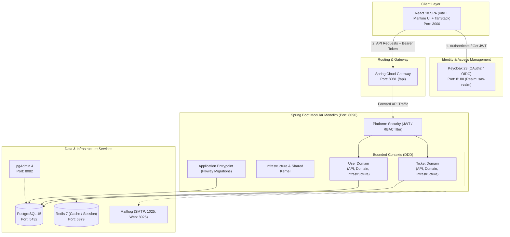

# OmniShift SAV - Support & After-Sales Management Platform

[](https://www.oracle.com/java/)
[](https://spring.io/projects/spring-boot)
[](https://reactjs.org/)
[](https://www.typescriptlang.org/)
[](https://vitejs.dev/)
[](https://www.keycloak.org/)
[](https://www.postgresql.org/)
[](https://www.docker.com/)
[](LICENSE)

**OmniShift SAV** (Service Après-Vente) is an enterprise-grade, full-stack support ticket management platform. Built to support technical operations and law firm software suites, OmniShift provides end-to-end incident management, technician workflows, real-time analytics, and role-based access control secured by OAuth2/OpenID Connect.

---

## 📑 Table of Contents

- [System Architecture](#-system-architecture)
- [Monorepo Structure](#-monorepo-structure)
- [Key Features](#-key-features)
- [Technology Stack](#-technology-stack)
- [Role-Based Access Control (RBAC)](#-role-based-access-control-rbac)
- [Prerequisites](#-prerequisites)
- [Getting Started](#-getting-started)
  - [1. Infrastructure Services (Docker Compose)](#1-infrastructure-services-docker-compose)
  - [2. Keycloak Setup](#2-keycloak-setup)
  - [3. Backend Setup](#3-backend-setup)
  - [4. Frontend Setup](#4-frontend-setup)
- [Ports & Services Reference](#-ports--services-reference)
- [API Overview & Authentication Flow](#-api-overview--authentication-flow)
- [Code Quality & Development](#-code-quality--development)
- [Roadmap](#-roadmap)
- [License](#-license)

---

## 🏗️ System Architecture

OmniShift SAV is built as a **decoupled monorepo** featuring:
- **Frontend SPA**: React 18 with TanStack Router, TanStack Query, and Mantine UI.
- **API Gateway**: Spring Cloud Gateway routing incoming requests, handling CORS, and proxying.
- **Backend**: Spring Boot 3.2.5 Modular Monolith implementing **Domain-Driven Design (DDD)** principles.
- **Identity & Access Management (IAM)**: Keycloak 23 providing OAuth2/OIDC token issuance and centralized user directory.
- **Persistence & Caching**: PostgreSQL 15 with Flyway migrations and Redis 7.



---

## 📁 Monorepo Structure

```text
omnishift-sav/
├── sav-backend/                       # Spring Boot 3 Modular Monolith
│   ├── application/                   # Main application runner & Flyway migrations
│   │   └── src/main/resources/db/migration/ # Flyway SQL migrations
│   ├── domains/                       # Bounded contexts (DDD)
│   │   ├── ticket/                    # Ticket domain
│   │   │   ├── ticket-api/            # REST controllers, DTOs & request mapping
│   │   │   ├── ticket-domain/         # Domain models, aggregates, business rules
│   │   │   └── ticket-infrastructure/ # Spring Data JPA repositories & entities
│   │   └── user/                      # User domain
│   │       ├── user-api/              # User controllers & endpoints
│   │       ├── user-domain/           # User aggregates & services
│   │       └── user-infrastructure/   # User persistence & Keycloak sync
│   ├── infrastructure/                # Cross-cutting infrastructure
│   │   ├── parent/                    # Maven parent POM with dependency management
│   │   └── shared/                    # Shared kernel, exceptions, utilities
│   ├── platform/                      # Platform modules
│   │   ├── gateway/                   # Spring Cloud Gateway (Port 8081)
│   │   └── security/                  # OAuth2 JWT resource server & RBAC filters
│   ├── init-scripts/                  # Database initialization scripts
│   ├── docker-compose.yml             # Docker services (Postgres, Keycloak, Redis, etc.)
│   ├── env.example                    # Backend environment template
│   ├── pom.xml                        # Root Maven reactor build
│   └── README.md                      # Backend specific documentation
│
├── sav-frontend/
│   └── front-tickets/                 # React 18 TypeScript Single Page Application
│       ├── public/                    # Static assets & silent SSO callback
│       ├── src/
│       │   ├── api/                   # Axios client, auth config, queryClient
│       │   ├── components/            # Reusable UI components & dialogs
│       │   │   ├── admin/             # Admin dashboards & user management
│       │   │   ├── shared/            # Navigation, headers, layout elements
│       │   │   ├── ui/                # Base form controls & buttons
│       │   │   ├── users/             # Technician & user directory views
│       │   │   └── workflow/          # Ticket queues (Assigned, Critical, etc.)
│       │   ├── constants/             # Enums, roles, storage keys, API routes
│       │   ├── contexts/              # Authentication context providers
│       │   ├── hooks/                 # TanStack Query custom hooks
│       │   ├── layout/                # Private & Public layouts
│       │   ├── routes/                # TanStack Router route definitions
│       │   ├── services/              # API services (ticketService, userService)
│       │   ├── store/                 # Zustand state stores (authStore, uiStore)
│       │   └── types/                 # TypeScript interfaces & API contracts
│       ├── package.json               # Frontend dependencies and scripts
│       ├── vite.config.ts             # Vite configuration
│       └── README.md                  # Frontend specific documentation
└── Readme.md                          # Root repository documentation (this file)
```

---

## ✨ Key Features

- **Multi-Role Incident Management**: Complete ticket lifecycle management (Create, Assign, Prioritize, In-Progress, Resolve, Close, Reopen).
- **Technician & Workflow Queues**: Specialized views for unassigned tickets, team-assigned tickets, high-priority, and critical-priority issues.
- **Interactive Discussion & Attachments**: Integrated messaging threads per ticket with file attachment capabilities.
- **Automated User Synchronization**: Seamless Just-In-Time (JIT) user profile provisioning in PostgreSQL upon first Keycloak JWT login.
- **Admin Dashboard & System Analytics**: Real-time KPI cards, ticket resolution velocity, user management, and team allocation.
- **Centralized Gateway & Security**: All frontend requests route via Spring Cloud Gateway (`:8081`) with JWT verification, CORS abstraction, and unified routing.
- **Pre-seeded Development Data**: Built-in Flyway migrations and development profiles providing ready-to-test users, tickets, and roles.

---

## 💻 Technology Stack

### Backend
| Technology | Version | Description |
|---|---|---|
| **Java** | 17 | Core programming language |
| **Spring Boot** | 3.2.5 | Application framework |
| **Spring Cloud Gateway**| 2023.0.x | Reactive API gateway |
| **Spring Security** | 6.x | OAuth2 Resource Server & JWT validation |
| **Spring Data JPA** | 3.x | ORM & database persistence |
| **Flyway** | Latest | Database schema versioning & migrations |
| **Maven** | 3.9+ | Multi-module build management |

### Frontend
| Technology | Version | Description |
|---|---|---|
| **React** | 18 | Declarative UI library |
| **TypeScript** | 5.9 | Type-safe JavaScript |
| **Vite** | 7.1 | Ultra-fast frontend bundler and dev server |
| **TanStack Router** | 1.131 | Type-safe routing with built-in route protection |
| **TanStack Query** | 5.85 | Server-state management, caching, and mutations |
| **Mantine UI** | 8.2 | Modern accessible UI component system |
| **Zustand** | 5.0 | Client-side reactive state management |
| **Keycloak-js** | 26.2 | Official OpenID Connect client adapter |
| **Axios** | 1.11 | HTTP client with bearer token interceptors |

### Infrastructure & DevOps
| Technology | Version | Description |
|---|---|---|
| **Docker & Docker Compose** | Latest | Containerized local environment |
| **PostgreSQL** | 15 Alpine | Primary relational database |
| **Keycloak** | 23.0 | Identity provider and SSO |
| **Redis** | 7 Alpine | In-memory cache & session store |
| **PgAdmin 4** | Latest | Web GUI for PostgreSQL |
| **Mailhog** | Latest | Local SMTP email server and web tester |

---

## 🔐 Role-Based Access Control (RBAC)

The system enforces granular role-based authorization:

| Capability | USER | TECHNICIAN | ADMIN |
|---|:---:|:---:|:---:|
| Create & view own tickets | ✅ | ✅ | ✅ |
| Add messages & attachments to own tickets | ✅ | ✅ | ✅ |
| Access personal dashboard | ✅ | ✅ | ✅ |
| View all tickets across the system | ❌ | ✅ | ✅ |
| Update ticket status, priority & resolution | ❌ | ✅ | ✅ |
| Access technician workflow queues | ❌ | ✅ | ✅ |
| View technician directory & lists | ❌ | ✅ | ✅ |
| Assign tickets to users & teams | ❌ | ❌ | ✅ |
| Create and manage system users | ❌ | ❌ | ✅ |
| Modify user roles & account statuses | ❌ | ❌ | ✅ |
| Access system administration & metrics | ❌ | ❌ | ✅ |

---

## ⚙️ Prerequisites

Before running the project locally, ensure you have the following installed:
- **Java Development Kit (JDK) 17+**
- **Node.js 18+** & **Yarn** (`corepack enable` or `npm install -g yarn`)
- **Docker** & **Docker Compose**
- **Git**

---

## 🚀 Getting Started

Follow these steps to spin up the entire OmniShift SAV ecosystem locally:

### 1. Infrastructure Services (Docker Compose)

Navigate to the `sav-backend` directory and start the supporting containers:

```bash
cd sav-backend
docker compose up -d
```

Verify that all services are healthy:
- **PostgreSQL**: `localhost:5432`
- **Keycloak**: `localhost:8180`
- **Redis**: `localhost:6379`
- **pgAdmin**: `localhost:8082`
- **Mailhog**: `localhost:8025`

### 2. Keycloak Setup

1. Open Keycloak Admin Console: **[http://localhost:8180/admin](http://localhost:8180/admin)**
2. Sign in with default admin credentials:
   - **Username**: `admin`
   - **Password**: `admin123`
3. Create a Realm named **`sav-realm`**.
4. Create Clients:
   - **`sav-backend`**:
     - Client authentication: **ON** (Confidential)
     - Valid redirect URIs: `http://localhost:8090/*`, `http://localhost:8081/*`
   - **`sav-frontend`**:
     - Client authentication: **OFF** (Public)
     - Valid redirect URIs: `http://localhost:3000/*`
     - Web origins: `http://localhost:3000`, `+`
5. Configure Realm Roles:
   - `ADMIN`
   - `TECHNICIAN`
   - `USER`
6. Create Demo Users & assign roles:
   - `admin` (Role: `ADMIN`)
   - `tech1` (Role: `TECHNICIAN`)
   - `user1` (Role: `USER`)
   *(Set permanent passwords for each user under the Credentials tab).*

### 3. Backend Setup

From the `sav-backend` directory:

1. Configure environment variables (optional for `dev` profile):
   ```bash
   cp env.example .env
   ```

2. Build the multi-module Maven project:
   ```bash
   ./mvnw clean install -DskipTests
   ```

3. Launch the application with the `dev` profile (enables pre-seeded demo data & Flyway migrations):
   ```bash
   ./mvnw spring-boot:run -Dspring-boot.run.profiles=dev
   ```

The backend starts on port **8090**, and the Gateway routes traffic on port **8081**.

### 4. Frontend Setup

In a new terminal, navigate to the frontend directory:

```bash
cd sav-frontend/front-tickets
```

1. Install dependencies:
   ```bash
   yarn install
   ```

2. Configure environment file:
   Create `.env.local`:
   ```env
   VITE_API_URL=http://localhost:8081
   VITE_KEYCLOAK_URL=http://localhost:8180
   VITE_KEYCLOAK_REALM=sav-realm
   VITE_KEYCLOAK_CLIENT_ID=sav-frontend
   ```

3. Start the Vite development server:
   ```bash
   yarn dev
   ```

4. Access the web application at **[http://localhost:3000](http://localhost:3000)**.

---

## 🌐 Ports & Services Reference

| Service | Port | URL | Default Credentials |
|---|---|---|---|
| **Frontend Application** | `3000` | [http://localhost:3000](http://localhost:3000) | Log in via Keycloak users |
| **API Gateway** | `8081` | [http://localhost:8081/api](http://localhost:8081/api) | Bearer JWT required |
| **Backend API Direct** | `8090` | [http://localhost:8090/api](http://localhost:8090/api) | Bearer JWT required |
| **Swagger UI** | `8090` | [http://localhost:8090/swagger-ui.html](http://localhost:8090/swagger-ui.html) | Public |
| **Spring Actuator Health**| `8090` | [http://localhost:8090/actuator/health](http://localhost:8090/actuator/health) | Public |
| **Keycloak Admin Console**| `8180` | [http://localhost:8180/admin](http://localhost:8180/admin) | `admin` / `admin123` |
| **PostgreSQL Database** | `5432` | `localhost:5432` | `admin` / `admin123` (db: `postgres`) |
| **pgAdmin 4** | `8082` | [http://localhost:8082](http://localhost:8082) | `admin@sav.com` / `admin123` |
| **Redis Cache** | `6379` | `localhost:6379` | No auth (default local) |
| **Mailhog Web UI** | `8025` | [http://localhost:8025](http://localhost:8025) | Public |

---

## 📡 API Overview & Authentication Flow

### Authentication Flow
1. User logs into Keycloak from the React application (`:3000`).
2. Keycloak issues a JWT bearer token containing user profile and realm/resource roles.
3. The React app injects the token in the `Authorization: Bearer <token>` header for all API requests directed at the Gateway (`:8081`).
4. Gateway proxies requests to Backend (`:8090`), where Spring Security validates the signature and extracts role claims.
5. On the first authenticated call, the User Domain automatically creates or synchronizes the user profile in PostgreSQL.

### Core API Endpoints

| Method | Endpoint | Description | Role Required |
|---|---|---|---|
| `GET` | `/actuator/health` | Service health status | Public |
| `GET` | `/api/users/me` | Fetch authenticated user profile | Any authenticated |
| `PUT` | `/api/users/me` | Update authenticated user profile | Any authenticated |
| `GET` | `/api/users` | List all users in system | `ADMIN` |
| `POST` | `/api/tickets` | Create a new ticket | `USER`, `TECHNICIAN`, `ADMIN` |
| `GET` | `/api/tickets` | List all tickets | `TECHNICIAN`, `ADMIN` |
| `GET` | `/api/tickets/my-tickets`| List current user's tickets | `USER`, `TECHNICIAN`, `ADMIN` |
| `GET` | `/api/tickets/{id}` | Get ticket details & messages | Authorized user |
| `PUT` | `/api/tickets/{id}` | Update ticket details/status | `TECHNICIAN`, `ADMIN` |
| `POST` | `/api/tickets/{id}/assign`| Assign ticket to user or team | `ADMIN` |

### Quick cURL Smoke Test

```bash
# 1. Fetch access token from Keycloak
TOKEN=$(curl -s -X POST http://localhost:8180/realms/sav-realm/protocol/openid-connect/token \
  -H "Content-Type: application/x-www-form-urlencoded" \
  -d "username=admin&password=admin123&grant_type=password&client_id=sav-backend&client_secret=<YOUR_CLIENT_SECRET>" \
  | jq -r '.access_token')

# 2. Query user profile via Gateway
curl -X GET http://localhost:8081/api/users/me \
  -H "Authorization: Bearer $TOKEN"

# 3. Create a ticket
curl -X POST http://localhost:8081/api/tickets \
  -H "Authorization: Bearer $TOKEN" \
  -H "Content-Type: application/json" \
  -d '{
    "title": "System Connectivity Alert",
    "description": "Unable to connect to document indexing service.",
    "type": "BUG",
    "priority": "HIGH"
  }'
```

---

## 🛠️ Code Quality & Development

### Frontend Commands
```bash
cd sav-frontend/front-tickets

yarn dev          # Start Vite dev server with HMR
yarn build        # Compile TypeScript and bundle production build
yarn lint         # Run ESLint checks
yarn lint:fix     # Automatically fix ESLint errors
yarn format       # Format codebase using Prettier
yarn type-check   # Validate TypeScript types without emitting
```

### Backend Commands
```bash
cd sav-backend

./mvnw clean compile           # Compile all modules
./mvnw clean test              # Execute unit and integration tests
./mvnw clean package           # Package JARs
```

---

## 🗺️ Roadmap

- [ ] **Real-time Push Notifications**: WebSocket / SSE integration for live ticket updates and technician assignment alerts.
- [ ] **SLA Management**: Automated SLA escalation timers and email alerts for critical tickets.
- [ ] **Elasticsearch / OpenSearch**: Full-text search across historical tickets and attachments.
- [ ] **Multi-tenancy**: Isolated tenant boundaries for multiple firm branches.
- [ ] **Mobile App**: Dedicated React Native support portal.

---

## 📄 License

This project is licensed under the MIT License - see the [LICENSE](LICENSE) file for details.
